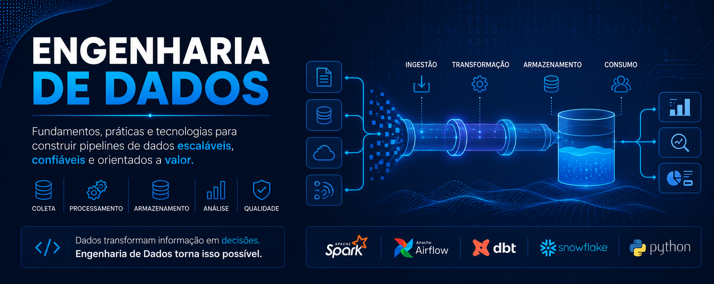
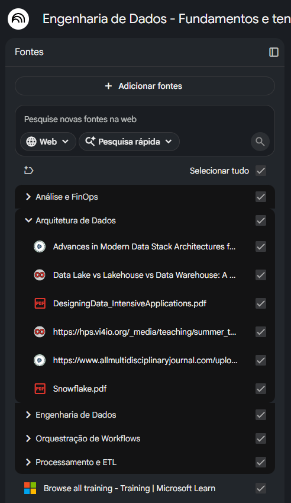
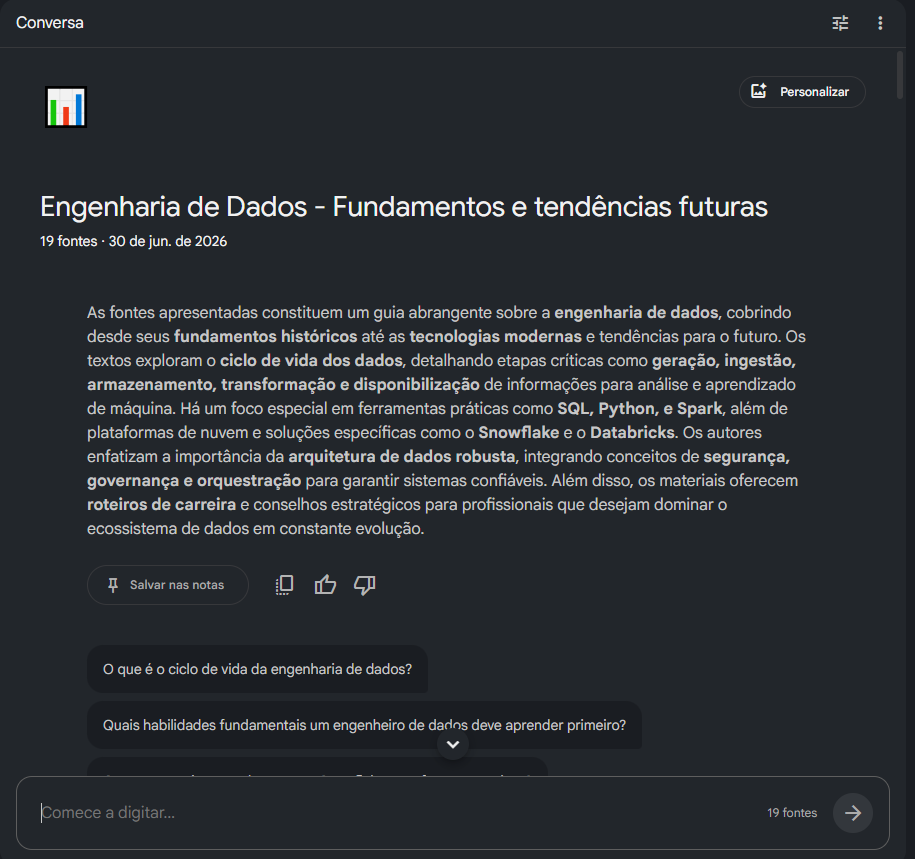
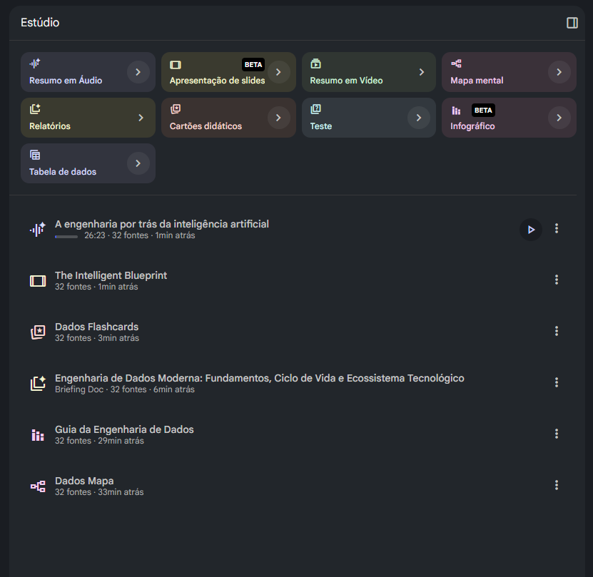
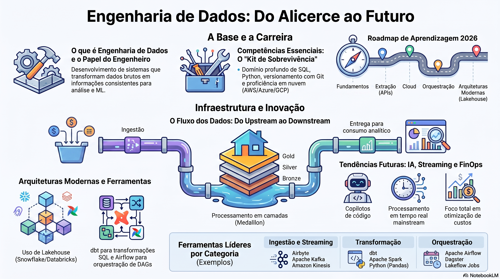
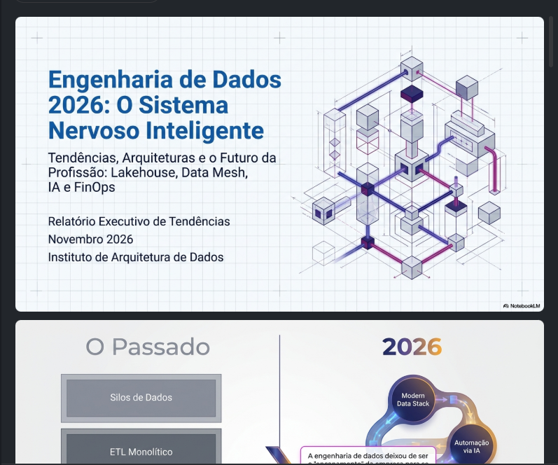
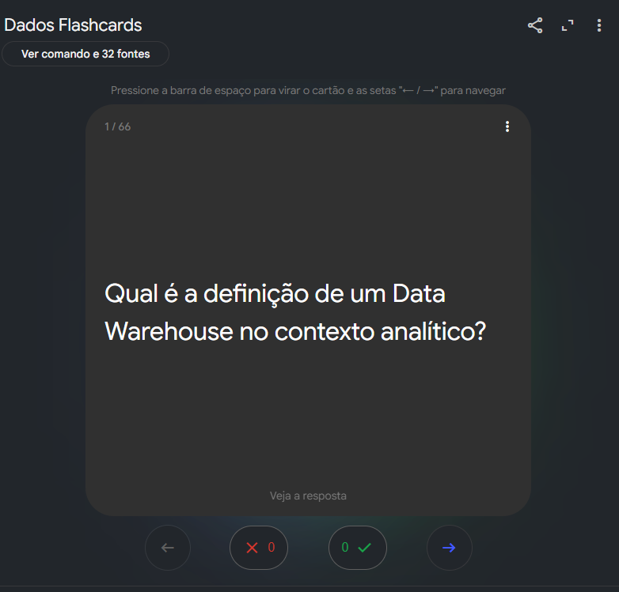
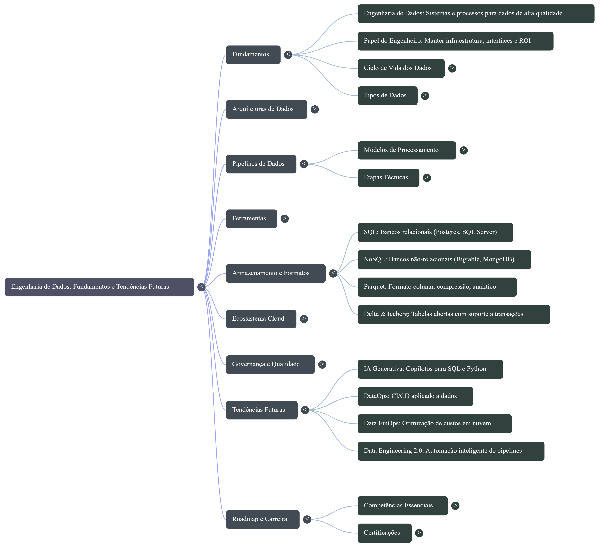
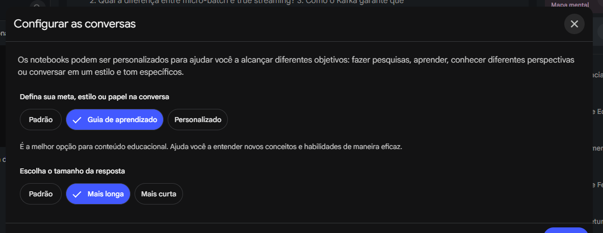

# 📚 Engenharia de Dados: Fundamentos e Tendências Futuras



<p align="center">


---

# 📑 Índice

- [Sobre o Projeto](#-sobre-o-projeto)
- [Objetivos](#-objetivos)
- [NotebookLM](#-notebooklm)
- [Curadoria de Fontes](#-curadoria-de-fontes)
- [Mapa Mental](#-mapa-mental)
- [Engenharia de Prompts](#-engenharia-de-prompts)
- [Dificuldades Encontradas](#-dificuldades-encontradas)
- [Miniguia de Estudos](#-miniguia-de-estudos)
- [Glossário](#-glossário)
- [Prompts Reutilizáveis](#-prompts-reutilizáveis)
- [Aprendizados](#-aprendizados)
- [Próximos Estudos](#-próximos-estudos)
- [Referências](#-referências)

---

# 📖 Sobre o Projeto

Este projeto foi desenvolvido como parte do desafio da **Digital Innovation One (DIO)** utilizando o **Google NotebookLM** como ferramenta de aprendizagem ativa.

O tema escolhido foi:

> **Engenharia de Dados: Fundamentos e Tendências Futuras**

A proposta consiste em utilizar IA para organizar conhecimento, comparar diferentes fontes e produzir um material consolidado de estudos.

---

# 🎯 Objetivos

✔ Entender os fundamentos da Engenharia de Dados

✔ Conhecer a arquitetura moderna de dados

✔ Aprender quando utilizar Data Warehouse, Data Lake e Lakehouse

✔ Estudar ferramentas utilizadas pelo mercado

✔ Conhecer tendências para os próximos anos

✔ Criar um material de revisão reutilizável

---

# 🧠 NotebookLM

## 📌 Caderno Temático

**Tema**

> Engenharia de Dados: Fundamentos e Tendências Futuras

---

## 📂 Estrutura do NotebookLM

O NotebookLM tráz ferrarmentas incríveis para estudar qualquer tipo de assunto, é possivel subir todas fontes (texto, videos, links, pdfs, etc.) relacionadas ao assunto deseja se aprofundar, usar a conversa com uma IA focada no conteúdo disponibilizado (É uma LLM com RAG prontinha pra usar), e ainda gerar diversos tipos de materiais de apoio como infográficos, mapas mentais e até mesmo um podcast.

Abaixo um pouquinho do layout da aplicação:

### 📚 Fontes

Espaço destinado ao upload dos artigos, livros, PDFs e documentações.

📷 **Print da Seção Fontes onde todo material é incluído, é possivel categorizar o contéudo pra ficar mais organizado.**



---

### 💬 Conversas

Espaço utilizado para realizar perguntas ao NotebookLM.

📷 **No print dessa sessão é possivel ver que ela faz um resumo com base em todo conteúdo nas fontes, ela pode ser personalizada e também configurada pra mudar o tipo de padrão de respostas. As sugestões de perguntas são muito úteis.**



---

### 📖 Estúdio

📷 **As possibilidades são muitas, voce pode personalizar os prompts ao gerar o material ou usar as sugestões que a ferramenta dá.**



Área utilizada para geração automática de:

- Testes
- Guias de estudo
- Linha do tempo
- Podcasts
- Resumos em Video
- Mapas mentais

📷





---

# 📚 Curadoria de Fontes

## Livros

| Fonte                              | Tipo | Link                                                       |
| ---------------------------------- | ---- | ---------------------------------------------------------- |
| Fundamentals of Data Engineering   | PDF  | [Acesse](docs/pdf/Fundamentals_DataEngineering.pdf)        |
| Spark - The Definitive Guide       | PDF  | [Acesse](<docs/pdf/Spark-The Definitive Guide.pdf>)        |
| Data Engineering Google Cloud      | PDF  | [Acesse](docs/pdf/DataEngineering_GoogleCloud.pdf)         |
| Design Data Intensive Applications | PDF  | [Acesse](docs/pdf/DesigningData_IntensiveApplications.pdf) |
| Python fod Data Analysis           | PDF  | [Acesse](docs/pdf/Python-for-Data-Analysis.pdf)            |
| SnowFlake                          | PDF  | [Acesse](docs/pdf/Snowflake.pdf)                           |

---

## Documentações Oficiais

| Fonte          | Link                                                                               |
| -------------- | ---------------------------------------------------------------------------------- |
| Apache Airflow | [Acesse](https://airflow.apache.org/docs/)                                         |
| dbt            | [Acesse](https://docs.getdbt.com/docs/build/documentation?version=2.0&name=Fusion) |

---

## Artigos

| **Título**                                                                                             | **Link**                                                                                                                                                                      |
| ------------------------------------------------------------------------------------------------------ | ----------------------------------------------------------------------------------------------------------------------------------------------------------------------------- |
| **5 boas práticas com Data FinOps para reduzir custos na nuvem**                                       | [Acesse](https://www.google.com/url?sa=E&q=https%3A%2F%2Feleflow.com.br%2Fpt%2F5-boas-praticas-com-data-finops-para-reduzir-custos-na-nuvem%2F)                               |
| **7 melhores ferramentas de ETL Open Source**                                                          | [Acesse](https://www.google.com/url?sa=E&q=https%3A%2F%2Fwww.mindtek.com.br%2F2025%2F11%2F7-melhores-ferramentas-etl-open-source%2F)                                          |
| **BI Analyst - Developer Roadmaps**                                                                    | [Acesse](https://www.google.com/url?sa=E&q=https%3A%2F%2Froadmap.sh%2Fbi-analyst)                                                                                             |
| **Cloud Data Engineering 2026: AWS, GCP, Azure Full Guide - Data Vidhya**                              | [Acesse](https://www.google.com/url?sa=E&q=https%3A%2F%2Fdatavidhya.com%2Flearn%2Fcloud-and-infrastructure%2F)                                                                |
| **Data Engineering with Apache Airflow, Snowflake, Snowpark, dbt & Cosmos**                            | [Acesse](https://www.google.com/url?sa=E&q=https%3A%2F%2Fwww.snowflake.com%2Fen%2Fdevelopers%2Fguides%2Fdata-engineering-with-apache-airflow%2F)                              |
| **GCP data engineer certification vs AWS data certification : r/dataengineering - Reddit**             | [Acesse](https://www.google.com/url?sa=E&q=https%3A%2F%2Fwww.reddit.com%2Fr%2Fdataengineering%2Fcomments%2Fk3cjk3%2Fgcp_data_engineer_certification_vs_aws_data%2F)           |
| **Modern Data Engineering Architecture Across AWS, GCP, and Azure - DEV Community**                    | [Acesse](https://www.google.com/url?sa=E&q=https%3A%2F%2Fdev.to%2Fsalma_aga%2Fmodern-data-engineering-architecture-across-aws-gcp-and-azure-14o3)                             |
| **Roadmap Engenharia de Dados 2026 - Matheus Domingos's Newsletter**                                   | [Acesse](https://www.google.com/url?sa=E&q=https%3A%2F%2Fmatheusdomingos.substack.com%2Fp%2Froadmap-engenharia-de-dados-2026)                                                 |
| **Tendências da Engenharia de Dados para 2026: IA, Lakehouse, Data Mesh e o Futuro dos Dados - Cetax** | [Acesse](https://www.google.com/url?sa=E&q=https%3A%2F%2Fcetax.com.br%2Fengenharia-de-dados-em-2026%2F)                                                                       |
| **Update: Starting with Data Engineer roadmap - things to keep in mind? - Reddit**                     | [Acesse](https://www.google.com/url?sa=E&q=https%3A%2F%2Fwww.reddit.com%2Fr%2Fdataengineersindia%2Fcomments%2F1tbvrez%2Fupdate_starting_with_data_engineer_roadmap_things%2F) |

---

## Vídeos

| Fonte                                                                | Link                                                   |
| -------------------------------------------------------------------- | ------------------------------------------------------ |
| Perguntas que eliminam candidatos                                    | [Youtube](https://www.youtube.com/watch?v=VIW-7V_6Jwc) |
| APACHE AIRFLOW 3.0 - Tudo sobre a nova era da orquestração de dados! | [Youtube](https://www.youtube.com/watch?v=j6m4fW3SkzQ) |

---

# 🗺️ Mapa Mental

Abaixo um mapa que mostra o mapa mental de alguns do princiapis assuntos abordados nesse guia.



Acesse na integra do projeto [AQUI](https://notebooklm.google.com/notebook/524f0d08-7b60-4a8c-8834-e5ade43a3649/artifact/0ddea6a8-e077-4c21-af00-ee0f3a10d50a?utm_source=nlm_web_share&utm_medium=google_oo&utm_campaign=art_share_1&utm_content=&utm_smc=nlm_web_share_google_oo_art_share_1_).

---

# 💬 Engenharia de Prompts

É importante observar que que alem da Engenharia de Prompt que pode mudar drásticamente o resultado que se quer, existem também as configurações da conversa no chat da IA, ou seja, talvez o seu prompt esteja bem estruturado, mas nas configurações o tamanho das respostas está configurado como "curta", ou a meta está "padrão" mas a sua meta é estudar. Essas configurações alteram também a saida.



## Prompt 1

> Explique Engenharia de Dados como se eu fosse um desenvolvedor backend.

### Objetivo

Entender o papel do Engenheiro de Dados.

### Resultado

<details>
<summary>Clique aqui para ver o resultado</summary>
Como desenvolvedor backend, você constrói sistemas que gerenciam o estado de aplicações para usuários finais. A Engenharia de Dados é a aplicação dos mesmos princípios de engenharia de software para gerenciar o fluxo de dados em larga escala dentro de uma empresa
.
Para facilitar a sua transição, aqui está o "de-para" dos conceitos:
1. O "Workload": OLTP vs. OLAP
No backend, você lida com OLTP (Online Transaction Processing), focado em operações CRUD rápidas, alta concorrência e consistência ACID
.
O engenheiro de dados foca em OLAP (Online Analytical Processing). O objetivo não é atualizar um registro, mas escanear terabytes para calcular agregados (ex: ticket médio do ano)
. Enquanto você usa índices para buscas rápidas, nós usamos armazenamento colunar (como Parquet) para otimizar a leitura de grandes volumes
.
2. O Fluxo: De APIs a Pipelines (ETL/ELT)
Se no backend você integra serviços via APIs, na engenharia de dados usamos Pipelines
. Existem dois padrões principais:
ETL (Extract, Transform, Load): O dado é limpo antes de ser salvo. É como fazer o parse de um payload antes de persistir no banco
.
ELT (Extract, Load, Transform): O dado bruto (JSON/CSV) é jogado direto no destino (Data Lake) e a transformação ocorre lá dentro, usando o poder da nuvem
.
3. A Orquestração: O "Workflow Engine"
Em vez de cron jobs simples ou filas de mensagens puras, usamos Orquestradores (como o Apache Airflow)
. Eles gerenciam DAGs (Directed Acyclic Graphs), que garantem que a "Tarefa B" (relatório) só execute se a "Tarefa A" (ingestão) terminar com sucesso
.
4. Arquitetura de Armazenamento
Onde guardamos tudo isso?
Data Warehouse: Banco de dados relacional gigante e otimizado para queries analíticas
.
Data Lake: Armazenamento de objetos (como S3) para dados em qualquer formato (brutos ou não estruturados)
.
Data Lakehouse: Arquitetura moderna que traz transações ACID e governança para dentro do Data Lake
.
5. DataOps: O CI/CD do Dado
Assim como você usa DevOps para garantir a estabilidade do código, o engenheiro de dados usa DataOps para a estabilidade do dado
. Isso inclui testes de qualidade (validar se há nulos onde não deveria) e observabilidade para monitorar a saúde dos pipelines
.
Fez sentido essa analogia com o mundo backend? Você já teve contato com alguma ferramenta de orquestração como o Airflow ou prefere que detalhemos como funciona o processamento distribuído com o Spark?
</details>

### O que funcionou

✔ A IA entendeu o que eu queria e usou um exemplo comum pra quem quem é desenvolvedor backend. Falou de OLAP e OLTP como exemplo. Trouxe pro contexto de APIs e Pipelines. No geral foi uma boa resposta.

### O que pode melhorar

❌Como a pergunta foi um pouco genérica a IA respondeu de forma sucinta e usando alguns exemplos. A responsta foi em texto markdown mas com a utilização de poucos elementos visuais que facilitam a compreensão. Uma boa melhoria no prompt seria pedir pra trazer tabelas comparativas.

---

## Prompt 2

> Crie um resumo estruturado em pdf com markdown sobre os seguintes assuntos em Engenharia de Software
> "
> Fundamentos:
>
> - Engenharia de Dados: Explique o papel da Engenharia de Dados dentro de um projeto de dados, suas responsabilidades, fluxo de trabalho, tecnologias envolvidas, competências exigidas pelo mercado, relação com Ciência de Dados, Analytics e Engenharia de Software, além das tendências futuras da profissão.
> - ETL: Explique o significado de Extract, Transform e Load, quando utilizar ETL, vantagens, limitações, exemplos práticos, ferramentas utilizadas e diferenças em relação ao ELT.
> - ELT: Explique como funciona, quando utilizar, diferenças para ETL, vantagens, limitações, exemplos práticos e plataformas que utilizam essa abordagem.
> - Batch: Explique funcionamento, vantagens, limitações, exemplos práticos, principais ferramentas e quando optar por processamento em lote em vez de streaming.
> - Pipeline: Explique todas as etapas de um pipeline moderno, desde a ingestão até o consumo dos dados, incluindo exemplos de arquiteturas e ferramentas.
> - Orquestração: Explique sua importância, funcionamento, vantagens, exemplos de DAGs, dependências, monitoramento e ferramentas como Apache Airflow.
>   " utilizando todas as fontes deste NotebookLM.
>
> Para cada tipo de assunto estruture além do descrito, os seguintes tópicos:
>
> O que é - Explique o conceito de forma simples.
>
> Objetivo - Qual problema esse conceito resolve?
>
> Como funciona - Explique passo a passo seu funcionamento.
>
> Principais componentes - Liste os principais elementos envolvidos.
>
> Vantagens - Liste os principais benefícios.
>
> Desvantagens - Liste limitações e desafios.
>
> Casos de uso - Apresente exemplos reais onde esse conceito é aplicado.
>
> Exemplos práticos - Inclua pelo menos dois exemplos.
>
> Relação com outros conceitos - Explique como esse assunto se conecta com outros temas da Engenharia de Dados.
>
> Ferramentas relacionadas - Cite as principais ferramentas utilizadas.
>
> Boas práticas - Liste recomendações para utilização.
>
> Tendências - Explique como esse conceito está evoluindo.
>
> Resumo em 5 tópicos - Finalize resumindo tudo em apenas cinco bullets.

### Objetivo

Gerar um resumo focado nos fundamentos de Engenharia de Dados

### Resultado

<details>
<summary>Clique aqui para ver o resultado</summary>
Com certeza! Já iniciei a criação do seu relatório técnico estruturado abrangendo todos esses pilares da Engenharia de Dados (DE, ETL, ELT, Batch, Pipelines e Orquestração).
O documento está sendo gerado com os 13 tópicos específicos que você solicitou para cada assunto, garantindo uma cobertura profunda desde as responsabilidades do cargo até as tendências para 2026, tudo fundamentado nas nossas 33 fontes com as devidas citações.
Você poderá visualizar o arquivo finalizado na aba Studio assim que o processamento for concluído.
Ficou alguma dúvida sobre o plano de tópicos ou quer explorar um desses conceitos em detalhes enquanto o documento carrega?

</details>

### O que funcionou

✔ A IA realmente criou o arquivo em markdown , estruturou todo counteúdo

### O que pode melhorar

❌Apesar de ter criado o arquivo separado ela não criou em pdf com foi solicitado e sim um arquivo no estudio .

❌Ela criou poucas tabelas e poucas comparações e deixou o markdown bem simples.

❌Se pedir apenas pra gerar markdown ela responde no chat mesmo. Importante pedir pra ia gerar em markdown puro em um bloco de código, se quiser colar em outro lugar.

❌Ela não tem a opção de PDF nem na exportação nem quando solicitado

---

# 🩹 Dificuldades Encontradas

| Problema                  | Como resolvi                                                      |
| ------------------------- | ----------------------------------------------------------------- |
| Respostas muito genéricas | Passei a limitar o contexto e detalhar mais o que eu queria ver   |
| Markdown simples demais   | Solicitei markdown puro melhrado em bloco de código               |
| Comparações em texto      | Pedi que sempre que houvesse comparações fossem feitas em tabelas |

---

# 📘 Miniguia de Estudos

## Fundamentos (Acesse o [Resumo](docs/resumos/Fundamentos.md) )

- Engenharia de Dados
- ETL
- ELT
- Batch
- Streaming
- Pipeline
- Orquestração

---

## Arquiteturas (Acesse o [Resumo](docs/resumos/Arquitetura.md) )

- Data Warehouse
- Data Lake
- Lakehouse
- Data Mesh
- Data Fabric

---

## Ferramentas (Acesse o [Resumo](docs/resumos/Ferramentas.md) )

- Apache Spark
- Apache Airflow
- dbt
- Kafka
- Delta Lake
- Docker
- Kubernetes

---

## Cloud (Acesse o [Resumo](docs/resumos/Cloud.md) )

- Azure
- AWS
- Google Cloud

---

## Tendências (Acesse o [Resumo](docs/resumos/Tendencias2026.md) )

- IA aplicada aos pipelines
- DataOps
- FinOps
- Qualidade de Dados
- Engenharia de Dados em tempo real

---

# 📖 Glossário

| Termo        | Significado                   |
| ------------ | ----------------------------- |
| ETL          | Extract Transform Load        |
| ELT          | Extract Load Transform        |
| Data Lake    | Repositório de dados brutos   |
| Lakehouse    | Mistura Data Lake + Warehouse |
| Pipeline     | Fluxo automatizado de dados   |
| Orquestração | Coordenação dos pipelines     |
| Batch        | Processamento em lote         |
| Streaming    | Processamento em tempo real   |

---

# 🚀 Prompts Reutilizáveis para Estudos com NotebookLM

> Estes prompts foram desenvolvidos utilizando técnicas de **Engenharia de Prompt** para extrair respostas mais completas, consistentes e contextualizadas do NotebookLM. Cada modelo pode ser reutilizado em diferentes áreas do conhecimento, bastando substituir o assunto desejado.

---

# 📖 1. Explicação Estruturada

## 🎯 Objetivo

Obter uma explicação completa, organizada e progressiva sobre um determinado assunto.

### Prompt

```text
Atue como um professor especialista no assunto "[TEMA]" e utilize todas as fontes disponíveis neste NotebookLM.

Explique o tema considerando diferentes níveis de conhecimento, iniciando por uma visão geral e evoluindo até conceitos mais avançados.

Estruture a resposta utilizando as seguintes seções:

1. Definição
2. Objetivo
3. Como funciona
4. Principais componentes
5. Vantagens
6. Limitações
7. Casos de uso
8. Exemplos práticos
9. Relação com outros conceitos presentes nas fontes
10. Boas práticas
11. Erros comuns
12. Tendências futuras

Ao final:

- Faça um resumo em cinco tópicos.
- Crie uma analogia simples para facilitar a compreensão.
- Sugira quais assuntos devem ser estudados em seguida.
```

### 📝 Técnicas de Engenharia de Prompt Utilizadas

| Técnica                    | Conceito                                                                                                                  |
| -------------------------- | ------------------------------------------------------------------------------------------------------------------------- |
| **Role Prompting**         | Define um papel específico ("professor especialista"), orientando o modelo a responder com maior profundidade e didática. |
| **Structured Output**      | Solicita uma estrutura fixa para tornar as respostas consistentes e fáceis de revisar.                                    |
| **Context Grounding**      | Obriga o modelo a utilizar apenas as fontes presentes no NotebookLM, reduzindo alucinações.                               |
| **Progressive Disclosure** | Solicita uma explicação do básico ao avançado, facilitando o aprendizado gradual.                                         |

---

# ⚖️ 2. Comparação entre Conceitos

## 🎯 Objetivo

Comparar tecnologias, arquiteturas ou metodologias de forma clara.

### Prompt

```text
Compare "[CONCEITO A]" e "[CONCEITO B]" utilizando exclusivamente as informações disponíveis nas fontes deste NotebookLM.

Estruture a resposta em uma tabela contendo:

- Definição
- Objetivo
- Arquitetura
- Vantagens
- Desvantagens
- Casos de uso
- Exemplos
- Complexidade
- Escalabilidade
- Custo
- Quando utilizar
- Quando evitar

Ao final:

- Resuma as principais diferenças em cinco tópicos.
- Explique qual seria a melhor escolha para três cenários reais diferentes.
```

### 📝 Técnicas Utilizadas

| Técnica                      | Conceito                                                                |
| ---------------------------- | ----------------------------------------------------------------------- |
| **Comparative Prompting**    | Direciona o modelo para realizar análises comparativas entre conceitos. |
| **Constraint Prompting**     | Restringe a resposta às fontes do NotebookLM.                           |
| **Tabular Output**           | Solicita saída em tabela para facilitar comparação visual.              |
| **Scenario-Based Prompting** | Utiliza cenários reais para demonstrar aplicação prática.               |

---

# 🛣️ 3. Roadmap de Aprendizagem

## 🎯 Objetivo

Criar um plano de estudos progressivo.

### Prompt

```text
Crie um roadmap completo para aprender "[TEMA]" utilizando todas as fontes deste NotebookLM.

Organize o conteúdo em níveis de dificuldade:

- Iniciante
- Básico
- Intermediário
- Avançado
- Especialista

Para cada etapa informe:

- Objetivos de aprendizagem
- Conceitos essenciais
- Ferramentas
- Pré-requisitos
- Exercícios recomendados
- Projetos práticos
- Tempo médio de estudo

Ao final, apresente uma linha do tempo sugerida para concluir todo o roadmap.
```

### 📝 Técnicas Utilizadas

| Técnica                  | Conceito                                                        |
| ------------------------ | --------------------------------------------------------------- |
| **Task Decomposition**   | Divide um objetivo complexo em etapas menores e organizadas.    |
| **Planning Prompting**   | Solicita um plano estruturado antes da resposta final.          |
| **Sequential Reasoning** | Organiza o conhecimento em uma sequência lógica de aprendizado. |

---

# ❓ 4. Quiz Inteligente

## 🎯 Objetivo

Gerar exercícios para revisão.

### Prompt

```text
Crie um quiz completo sobre "[TEMA]" utilizando todas as fontes disponíveis.

Gere:

- 10 questões fáceis
- 10 questões intermediárias
- 10 questões avançadas

Misture:

- múltipla escolha
- verdadeiro ou falso
- perguntas abertas
- estudos de caso

Após cada questão apresente:

- resposta correta
- explicação
- justificativa
- referência ao conteúdo utilizado.
```

### 📝 Técnicas Utilizadas

| Técnica                        | Conceito                                           |
| ------------------------------ | -------------------------------------------------- |
| **Few-Shot Style Instruction** | Define claramente o formato esperado das questões. |
| **Difficulty Scaling**         | Solicita níveis crescentes de dificuldade.         |
| **Retrieval Grounding**        | Baseia as respostas nas fontes disponíveis.        |

---

# 💼 5. Simulação de Entrevista

## 🎯 Objetivo

Preparação para entrevistas técnicas.

### Prompt

```text
Atue como um entrevistador técnico especialista em "[ÁREA]".

Utilizando todas as fontes deste NotebookLM:

- Faça uma pergunta por vez.
- Aguarde minha resposta antes de prosseguir.
- Avalie minha resposta.
- Explique os pontos fortes.
- Explique os pontos que precisam melhorar.
- Mostre como seria uma resposta considerada excelente pelo mercado.
- Ao final atribua uma nota de 0 a 10.
```

### 📝 Técnicas Utilizadas

| Técnica                   | Conceito                                                  |
| ------------------------- | --------------------------------------------------------- |
| **Persona Prompting**     | Define o modelo como entrevistador técnico.               |
| **Interactive Prompting** | Cria uma interação contínua em vez de uma resposta única. |
| **Self-Evaluation**       | Solicita análise crítica da resposta do usuário.          |

---

# 🧠 6. Mapa Mental

## 🎯 Objetivo

Organizar visualmente um tema.

### Prompt

```text
Crie um mapa mental completo sobre "[TEMA]" utilizando todas as fontes deste NotebookLM.

Organize o conteúdo em níveis hierárquicos.

Inclua:

- conceitos principais
- subtópicos
- conexões entre conceitos
- exemplos
- ferramentas relacionadas
- tendências futuras

Utilize palavras-chave curtas em cada nó.
```

### 📝 Técnicas Utilizadas

| Técnica                      | Conceito                                        |
| ---------------------------- | ----------------------------------------------- |
| **Hierarchical Structuring** | Organiza informações em níveis hierárquicos.    |
| **Knowledge Mapping**        | Estimula a criação de relações entre conceitos. |
| **Summarization Prompting**  | Condensa informações em palavras-chave.         |

---

# 📊 7. Infográfico

## 🎯 Objetivo

Criar um resumo visual.

### Prompt

```text
Crie um infográfico sobre "[TEMA]" utilizando todas as fontes deste NotebookLM.

Organize o conteúdo em blocos contendo:

- conceito
- importância
- aplicações
- ferramentas
- vantagens
- tendências

Utilize frases curtas e destaque os pontos mais importantes.
```

### 📝 Técnicas Utilizadas

| Técnica                     | Conceito                                              |
| --------------------------- | ----------------------------------------------------- |
| **Visual Structuring**      | Solicita organização semelhante a materiais gráficos. |
| **Information Compression** | Resume grandes quantidades de informação.             |
| **Semantic Grouping**       | Agrupa conceitos relacionados em blocos temáticos.    |

---

# 📝 8. Resumo Estruturado

## 🎯 Objetivo

Criar um material completo para revisão.

### Prompt

```text
Crie um resumo estruturado sobre "[TEMA]" utilizando todas as fontes deste NotebookLM.

Estruture em:

- Definição
- Objetivo
- Funcionamento
- Componentes
- Benefícios
- Limitações
- Casos de uso
- Exemplos
- Ferramentas relacionadas
- Boas práticas
- Tendências

Ao final gere:

- um glossário
- cinco perguntas de revisão
- três erros comuns
- três conexões com outros assuntos
- uma sugestão de aprofundamento.
```

### 📝 Técnicas Utilizadas

| Técnica                           | Conceito                                                                 |
| --------------------------------- | ------------------------------------------------------------------------ |
| **Template Prompting**            | Utiliza um modelo padronizado para respostas consistentes.               |
| **Retrieval-Augmented Prompting** | Incentiva o uso das informações presentes nas fontes do NotebookLM.      |
| **Knowledge Consolidation**       | Consolida conceitos, exemplos e conexões em um único material de estudo. |

---

# 📚 9. Glossário Inteligente

## 🎯 Objetivo

Criar um dicionário de termos técnicos.

### Prompt

```text
Crie um glossário completo sobre "[TEMA]" utilizando exclusivamente as fontes deste NotebookLM.

Para cada termo apresente:

- definição
- explicação simplificada
- exemplo prático
- relação com outros conceitos
- importância dentro do tema

Organize os termos em ordem alfabética.
```

### 📝 Técnicas Utilizadas

| Técnica                    | Conceito                                                  |
| -------------------------- | --------------------------------------------------------- |
| **Controlled Output**      | Controla o formato da resposta para manter consistência.  |
| **Knowledge Organization** | Estrutura o conhecimento em formato de referência rápida. |

---

# 🧩 10. Estudo de Caso

## 🎯 Objetivo

Aplicar teoria em situações reais.

### Prompt

```text
Utilizando todas as fontes deste NotebookLM, crie um estudo de caso relacionado ao tema "[TEMA]".

Apresente:

- contexto do problema
- requisitos
- desafios
- possíveis soluções
- tecnologias envolvidas
- justificativa técnica
- boas práticas
- lições aprendidas

Ao final explique por que essa solução seria a mais adequada.
```

### 📝 Técnicas Utilizadas

| Técnica                         | Conceito                                                                                               |
| ------------------------------- | ------------------------------------------------------------------------------------------------------ |
| **Scenario-Based Prompting**    | Ensina por meio de situações práticas e contextualizadas.                                              |
| **Problem Solving Prompting**   | Estimula o raciocínio para resolução de problemas.                                                     |
| **Decision-Oriented Prompting** | Solicita justificativas para as escolhas realizadas, aproximando a resposta de decisões do mundo real. |

---

## 💡 Conceitos de Engenharia de Prompt Utilizados

| Técnica                      | Objetivo                                                                                                                       |
| ---------------------------- | ------------------------------------------------------------------------------------------------------------------------------ |
| **Role Prompting**           | Define um papel para o modelo (professor, arquiteto, entrevistador etc.), influenciando o estilo e a profundidade da resposta. |
| **Context Grounding**        | Limita as respostas ao contexto ou às fontes fornecidas, reduzindo informações inventadas.                                     |
| **Structured Output**        | Solicita um formato de saída específico (listas, tabelas ou seções), facilitando leitura e reutilização.                       |
| **Constraint Prompting**     | Impõe restrições claras sobre escopo, formato ou conteúdo da resposta.                                                         |
| **Task Decomposition**       | Divide tarefas complexas em etapas menores para obter respostas mais organizadas.                                              |
| **Sequential Reasoning**     | Organiza o raciocínio em uma sequência lógica de passos ou níveis.                                                             |
| **Scenario-Based Prompting** | Utiliza cenários práticos para contextualizar e aplicar o conhecimento.                                                        |
| **Template Prompting**       | Define um modelo padronizado de resposta, garantindo consistência entre diferentes consultas.                                  |
| **Interactive Prompting**    | Conduz uma conversa iterativa, em que o modelo faz perguntas, recebe respostas e ajusta a interação.                           |
| **Knowledge Mapping**        | Organiza conceitos e suas relações em estruturas hierárquicas, como mapas mentais.                                             |
| **Information Compression**  | Resume grandes volumes de informação em pontos-chave, preservando o essencial para revisão rápida.                             |

---

# 📈 Aprendizados

- Entendimento da arquitetura moderna de dados.
- Diferença entre Data Lake, Warehouse e Lakehouse.
- Importância da orquestração de pipelines.
- Tendências da Engenharia de Dados para os próximos anos.
- Uso do NotebookLM como ferramenta de estudo.

---

# 📚 Próximos Estudos

- [ ] Apache Kafka
- [ ] Apache Flink
- [ ] Delta Lake
- [ ] Iceberg
- [ ] Databricks
- [ ] Data Mesh
- [ ] Data Fabric
- [ ] Snowflake
- [ ] BigQuery

---

# 🔗 Referências

- NotebookLM
- Apache Airflow
- dbt
- Apache Spark
- Fundamentals of Data Engineering
- Modern Data Stack

---

# 👨‍💻 Autor

**Alan Rodrigues Monteiro Matias**

[LinkedIn](https://www.linkedin.com/in/alanmmatias)

[GitHub](https://github.com/Aonay)

---

⭐ Projeto desenvolvido para o desafio da **Digital Innovation One (DIO)** utilizando **Google NotebookLM** como ferramenta de aprendizagem ativa.
